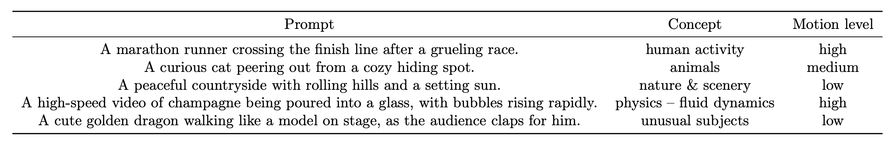
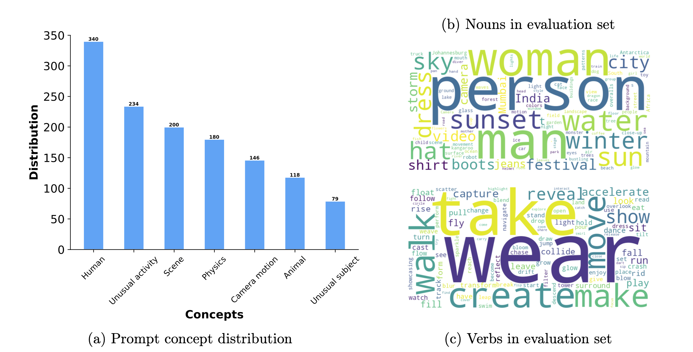

# Movie Gen Bench
[Movie Gen](https://ai.meta.com/research/movie-gen/) is a cast of foundation models that generates high-quality, 1080p HD videos with different aspect ratios and synchronized audio.
Here, we introduce our evaluation benchmark "Movie Gen Bench", which includes Movie Gen Video Bench (Section 3.5.2) and Movie Gen Audio Bench (Section 6.3.2), as detailed in the [Movie Gen technical report](https://ai.meta.com/static-resource/movie-gen-research-paper).

To enable fair and easy comparison to Movie Gen for future works on these evaluation benchmarks, we additionally release the non cherry-picked generated videos from Movie Gen on both Movie Gen Video Bench and Movie Gen Audio Bench.

## Table of Contents
- [Movie Gen Video Bench](#movie-gen-video-bench)
- [Movie Gen Audio Bench](#movie-gen-audio-bench)
- [License](#license)
- [Citation](#citation)

## Movie Gen Video Bench
Movie Gen Video Bench consists of 1003 prompts that cover all the different testing aspects/concepts:
 1. human activity (limb and mouth motion, emotions, etc.)
 2. animals
 3. nature and scenery 
 4. physics (fluid dynamics, gravity, acceleration, collisions, explosions, etc.)
 5. unusual subjects and unusual activities. 

Besides a comprehensive coverage of different key testing aspects, the prompts also have a good coverage of high/medium/low motion levels at the same time. 





### Download Video Benchmark

The prompt list ```benchmark/MovieGenVideoBench.txt``` is included in this repo, and the corresponding generated videos (by Movie Gen) can be [downloaded via this link](https://d1dk99z05ygk7h.cloudfront.net/MovieGenVideoBench.tar.gz?Policy=eyJTdGF0ZW1lbnQiOlt7InVuaXF1ZV9oYXNoIjoiODRrb3lmNWRqYjRybTd1cTVlcDdvd3dpIiwiUmVzb3VyY2UiOiJodHRwczpcL1wvZDFkazk5ejA1eWdrN2guY2xvdWRmcm9udC5uZXRcLyoiLCJDb25kaXRpb24iOnsiRGF0ZUxlc3NUaGFuIjp7IkFXUzpFcG9jaFRpbWUiOjE3MzA4NDU3MzF9fX1dfQ__&Signature=RHY1bOfQ5dsYNuZe2jbnBRUqYyGdOQDZbG2yBywiV4B-lWUfYWH-dxmC8NPfAiDnGUGbdG-IJdvfSENToL8FZHguMKRdKzdN9DcXG7EbZcxz8o6oPInCTTEFOjgdGVWKmzqNowRFjuiNbSOHuBhyAc9CXmftoTR2dNcYS86rzdFAXLggfe1THj87njU7osJk0j6ZsD2ezoAmPZCKH76%7EBnfHQC74Cpo8KqJfHxjKwg5uXBkbV-Q5Ph2e8RTKsNTuRqxjzsQS9sGPjcFMywCzrusVmuBbdJ62DtolFRt9eBExRfZRvXee1xvzWjvlpQYTedfP044ZBieppm43ux-8dw__&Key-Pair-Id=K15QRJLYKIFSLZ).

Movie Gen Video Bench is also [available on Hugging Face](https://huggingface.co/datasets/meta-ai-for-media-research/movie_gen_video_bench).

## Movie Gen Audio Bench

Movie Gen Audio Bench consists of 527 generated videos and associated sound effects and music prompts
* It covers various ambient environments (e.g., indoor, urban, nature,transportation) and sound effects (e.g., human, animal, objects).
* Movie Gen Video is used to generate videos. We additionally include video prompts used to generate these videos.
* It can be used to evaluate sound effect generation and joint sound effect and background music generation.
* It can be used to evaluate video-to-audio and (text+video)-to-audio generation.

### Download Audio Benchmark 

```benchmark/MovieGenAudioBenchSfx.jsonl``` includes the sound effect prompts used for sound effect generation, and additionally video prompts used for generating testing videos. 
Videos with audio and prompts can be [downloaded via this link](https://d1dk99z05ygk7h.cloudfront.net/MovieGenAudioBenchSfx.tar.gz?Policy=eyJTdGF0ZW1lbnQiOlt7InVuaXF1ZV9oYXNoIjoiODRrb3lmNWRqYjRybTd1cTVlcDdvd3dpIiwiUmVzb3VyY2UiOiJodHRwczpcL1wvZDFkazk5ejA1eWdrN2guY2xvdWRmcm9udC5uZXRcLyoiLCJDb25kaXRpb24iOnsiRGF0ZUxlc3NUaGFuIjp7IkFXUzpFcG9jaFRpbWUiOjE3MzA4NDU3MzF9fX1dfQ__&Signature=RHY1bOfQ5dsYNuZe2jbnBRUqYyGdOQDZbG2yBywiV4B-lWUfYWH-dxmC8NPfAiDnGUGbdG-IJdvfSENToL8FZHguMKRdKzdN9DcXG7EbZcxz8o6oPInCTTEFOjgdGVWKmzqNowRFjuiNbSOHuBhyAc9CXmftoTR2dNcYS86rzdFAXLggfe1THj87njU7osJk0j6ZsD2ezoAmPZCKH76%7EBnfHQC74Cpo8KqJfHxjKwg5uXBkbV-Q5Ph2e8RTKsNTuRqxjzsQS9sGPjcFMywCzrusVmuBbdJ62DtolFRt9eBExRfZRvXee1xvzWjvlpQYTedfP044ZBieppm43ux-8dw__&Key-Pair-Id=K15QRJLYKIFSLZ).

```benchmark/MovieGenAudioBenchSfxMusic.jsonl``` includes the sound effect and music prompts used for joint sound effect and background music generation, and additionally video prompts used for generating testing videos.
Videos with audio and prompts can be [downloaded via this link](https://d1dk99z05ygk7h.cloudfront.net/MovieGenAudioBenchSfxMusic.tar.gz?Policy=eyJTdGF0ZW1lbnQiOlt7InVuaXF1ZV9oYXNoIjoiODRrb3lmNWRqYjRybTd1cTVlcDdvd3dpIiwiUmVzb3VyY2UiOiJodHRwczpcL1wvZDFkazk5ejA1eWdrN2guY2xvdWRmcm9udC5uZXRcLyoiLCJDb25kaXRpb24iOnsiRGF0ZUxlc3NUaGFuIjp7IkFXUzpFcG9jaFRpbWUiOjE3MzA4NDU3MzF9fX1dfQ__&Signature=RHY1bOfQ5dsYNuZe2jbnBRUqYyGdOQDZbG2yBywiV4B-lWUfYWH-dxmC8NPfAiDnGUGbdG-IJdvfSENToL8FZHguMKRdKzdN9DcXG7EbZcxz8o6oPInCTTEFOjgdGVWKmzqNowRFjuiNbSOHuBhyAc9CXmftoTR2dNcYS86rzdFAXLggfe1THj87njU7osJk0j6ZsD2ezoAmPZCKH76%7EBnfHQC74Cpo8KqJfHxjKwg5uXBkbV-Q5Ph2e8RTKsNTuRqxjzsQS9sGPjcFMywCzrusVmuBbdJ62DtolFRt9eBExRfZRvXee1xvzWjvlpQYTedfP044ZBieppm43ux-8dw__&Key-Pair-Id=K15QRJLYKIFSLZ).


## License

The model is licensed under the [CC-BY-NC license](LICENSE)

## Citation

If you find Movie Gen Bench useful, please consider citing:
```
@misc{polyak2024moviegencastmedia,
      title={Movie Gen: A Cast of Media Foundation Models}, 
      author={Adam Polyak and Amit Zohar and Andrew Brown and Andros Tjandra and Animesh Sinha and Ann Lee and Apoorv Vyas and Bowen Shi and Chih-Yao Ma and Ching-Yao Chuang and David Yan and Dhruv Choudhary and Dingkang Wang and Geet Sethi and Guan Pang and Haoyu Ma and Ishan Misra and Ji Hou and Jialiang Wang and Kiran Jagadeesh and Kunpeng Li and Luxin Zhang and Mannat Singh and Mary Williamson and Matt Le and Matthew Yu and Mitesh Kumar Singh and Peizhao Zhang and Peter Vajda and Quentin Duval and Rohit Girdhar and Roshan Sumbaly and Sai Saketh Rambhatla and Sam Tsai and Samaneh Azadi and Samyak Datta and Sanyuan Chen and Sean Bell and Sharadh Ramaswamy and Shelly Sheynin and Siddharth Bhattacharya and Simran Motwani and Tao Xu and Tianhe Li and Tingbo Hou and Wei-Ning Hsu and Xi Yin and Xiaoliang Dai and Yaniv Taigman and Yaqiao Luo and Yen-Cheng Liu and Yi-Chiao Wu and Yue Zhao and Yuval Kirstain and Zecheng He and Zijian He and Albert Pumarola and Ali Thabet and Artsiom Sanakoyeu and Arun Mallya and Baishan Guo and Boris Araya and Breena Kerr and Carleigh Wood and Ce Liu and Cen Peng and Dimitry Vengertsev and Edgar Schonfeld and Elliot Blanchard and Felix Juefei-Xu and Fraylie Nord and Jeff Liang and John Hoffman and Jonas Kohler and Kaolin Fire and Karthik Sivakumar and Lawrence Chen and Licheng Yu and Luya Gao and Markos Georgopoulos and Rashel Moritz and Sara K. Sampson and Shikai Li and Simone Parmeggiani and Steve Fine and Tara Fowler and Vladan Petrovic and Yuming Du},
      year={2024},
      eprint={2410.13720},
      archivePrefix={arXiv},
      primaryClass={cs.CV},
      url={https://arxiv.org/abs/2410.13720}, 
}
```
